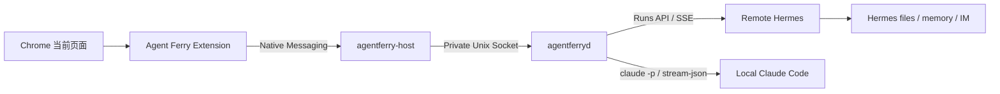
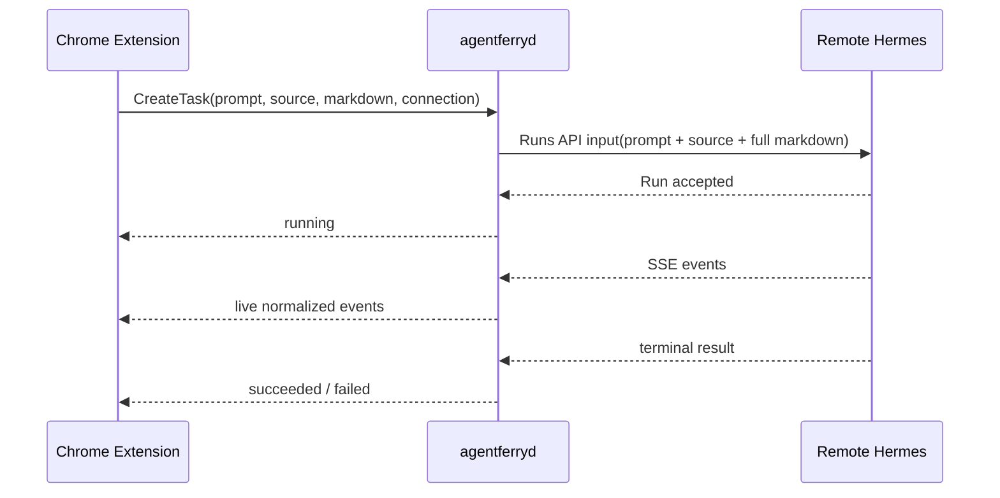
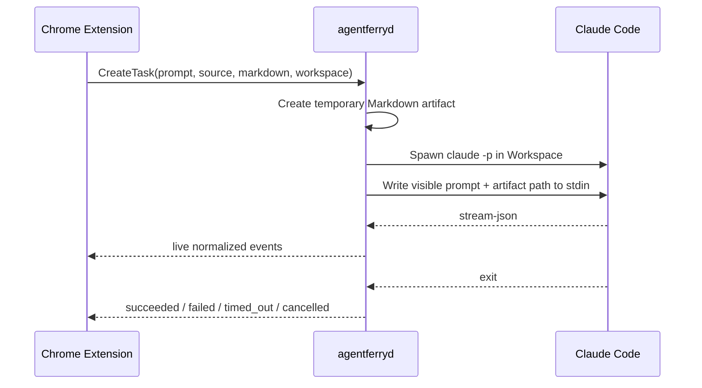
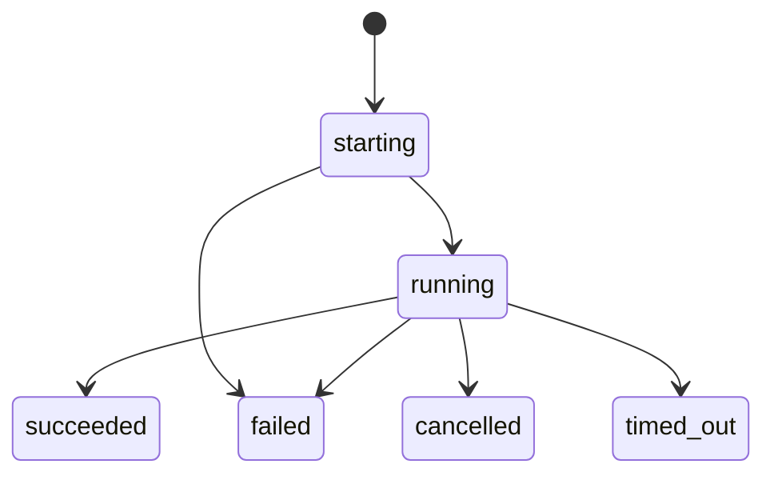

# Agent Ferry V0.1 顶层方案

> 状态：Historical
> 事实来源：2026-07-15 的 V0.1 设计基线
> 范围：早期 Hermes/Claude 实时交接方案；当前实现见 `docs/architecture/overview.md`

## 1. 目标

V0.1 只验证一条纵向闭环：用户在 Chrome 中把当前论文、Twitter/X、YouTube、arXiv 或普通网页的实际内容交给一个 Agent，任务自动开始，并在浏览器界面仍连接时实时看到输出。

首批目标按实现优先级排列：

1. 用户服务器上的云端 Hermes；
2. 用户本机已有的 Claude Code。

产品保持轻量：不实现 Agent Loop，不安装第三方 Agent，不引入 ACP adapter，不保存 Agent 回复历史。

## 2. V0.1 明确不做

- ACP Managed Session；
- 多轮继续对话、澄清问题和权限审批；
- Ferry 结果持久化、历史列表、通知、补发和 attach；
- sandbox、worktree 隔离和 Workspace 并发协调；
- Side Panel、Web Terminal 或独立桌面 UI；
- Codex、OpenCode、Pi 和本地 Hermes；
- Ferry 管理的 Agent Pack 安装；
- 浏览器以外的 daemon Connector。

这些能力必须在纵向闭环稳定后单独设计，不能提前把 V0.1 重新扩张为 Agent 平台。

## 3. 系统上下文



### 3.1 Chrome Extension

负责当前页面提取、Prompt 模板选择、最终 Prompt 编辑、目标选择、提交和实时输出展示。扩展不能安装软件、读取 Hermes token、修改 Agent 路径或执行任意 shell 命令。

### 3.2 Native Host

只处理 Chrome Native Messaging framing、扩展身份边界和本地 IPC 转发，不持有业务状态、不启动 Agent、不保存内容。

### 3.3 agentferryd

本机交接中枢，负责：

- Connector 认证和 capability 校验；
- Workspace、Claude 路径和 Hermes Connection 配置；
- 临时 Artifact；
- 本地子进程和远程 Run 生命周期；
- 实时事件规范化与转发；
- 取消、超时和资源清理。

### 3.4 Agent Controller

V0.1 只有两个 Controller：

```text
ClaudePrintController
RemoteHermesController
```

它们实现同一个最小任务接口，但不伪装能力相同：

```text
detect
start_task
stream_events
cancel_if_supported
dispose
```

## 4. 浏览器内容捕获

### 4.1 通用路径

1. 在明确的时间、滚动次数和内容量上限内触发懒加载；
2. 恢复用户滚动位置；
3. 使用 Defuddle 提取标题、正文、作者、时间、URL 和元数据；
4. 生成规范化 Markdown，并记录 extractor 与完整性状态。

### 4.2 特殊来源

| 来源 | V0.1 策略 |
|---|---|
| Twitter/X | 优先使用专用 extractor，保留线程结构与来源链接 |
| YouTube | 专用 extractor，优先字幕/转录文本及视频元数据 |
| arXiv HTML | 通用解析为主，保留论文元数据 |
| arXiv PDF | 独立下载与 PDF 文本解析链路 |
| 其他网页 | 有界懒加载后走 Defuddle |

捕获失败、正文为空或明显不完整时必须显示错误或完整性提示，不能静默退化成只发送 URL。

## 5. Prompt 组装

扩展只有一个用户可见的最终 Prompt 编辑框：

1. 选择模板后将解析结果填入编辑框；
2. 用户可以针对本次任务修改；
3. 未选择模板时填入最小默认 Prompt；
4. Ferry 不在编辑框之外追加隐藏任务意图。

协议层可以加入非任务性的结构字段，例如 source、artifact path 和 task id，但发送给 Agent 的任务要求必须对用户可见。

## 6. 云端 Hermes 路径



约束：

- 优先 Direct URL，适用于 Tailscale、WireGuard、可信 LAN 或 HTTPS；SSH Tunnel 作为回退；
- 两种 Transport 都使用 Hermes Bearer Token，值只保存在 macOS Keychain；
- 先读取 capability，再决定是否展示 SSE 和取消；
- Prompt、来源和完整 Markdown 放入单次 Runs API input；不静默截断；超过服务端限制时明确失败；
- 浏览器断开不取消远程 Run；Ferry 不保存结果、不重连、不补发；
- Hermes 自己决定文件、记忆、摘要和索引，Ferry 不访问远程文件系统。

## 7. 本地 Claude Code 路径



启动基线：

```text
executable: 用户明确绑定的 Claude Code 绝对路径
cwd:        选定 Workspace
argv:       -p --permission-mode bypassPermissions
            --output-format stream-json --verbose
stdin:      用户可见 Prompt + source + Artifact 绝对路径
```

运行规则：

- Claude Code 由用户安装、认证和升级，Ferry 只检测并给官方指引；
- 不安装 `claude-code-acp`，不携带 Node runtime；
- 不使用 shell 字符串；Prompt 通过 stdin 写入后关闭；
- 不使用 `--bare`，继续沿用用户登录、CLAUDE.md、Skills、hooks 和项目配置；
- 不传 `--no-session-persistence`，但 Ferry 不读取或依赖 Claude 原生会话；
- V0.1 固定使用 `bypassPermissions`；Ferry 不限制文件、Shell 或网络工具；
- Workspace 是 cwd，不是 sandbox；Claude 具有当前操作系统用户权限；
- 每次任务使用独立 UUID，不使用 `--continue` 或 `--resume`；
- 同 Workspace 任务允许并行，Ferry 不协调文件和 Git 冲突；
- 默认 60 分钟超时；取消或超时终止整个进程组；
- 浏览器断开不取消任务，daemon 继续排空并丢弃无人订阅的输出。

## 8. 实时事件模型

两个 Controller 统一输出最小事件集合：

```text
task.started
task.status
output.delta
output.final
task.succeeded
task.failed
task.cancelled
task.timed_out
```

每个事件至少包含：

```text
protocol_version
task_id
sequence
timestamp
event_type
payload
```

`sequence` 只用于当前连接内排序，V0.1 不承诺持久化游标或重放。Native Messaging 使用有界消息帧；大正文必须分块传给 daemon 后再组装，不能形成单个无上限 JSON 消息。

## 9. 任务状态机



没有 `awaiting_approval`、`paused`、`resumable` 或产品队列状态。任务状态只存在于运行中 daemon 内存；V0.1 不做 daemon 重启恢复。

## 10. 数据与保留

| 数据 | 所有者 | V0.1 保留策略 |
|---|---|---|
| Prompt 模板 | Extension | 浏览器扩展配置持久化 |
| Workspace / Agent 路径 | daemon/CLI | 本机配置持久化 |
| Hermes token | macOS Keychain | 由用户删除 Connection 时清理 |
| 临时 Markdown Artifact | daemon | 结束后默认 24 小时 |
| Claude/Hermes 输出 | 不由 Ferry 持久化 | 仅当前实时连接 |
| Claude 原生会话 | Claude Code | 沿用 Claude 默认，Ferry 不读取 |
| Hermes 文件/记忆 | Hermes | 由 Hermes 自己决定 |

因此 V0.1 不需要为任务历史引入 SQLite；若未来 ACP 需要事件存储，再根据重放和恢复语义设计数据库。

## 11. Connector 与安全边界

V0.1 只有：

```text
Chrome Extension
  → Native Messaging allowlisted extension ID
  → signed Native Host
  → private Unix Domain Socket
  → agentferryd
```

不开放 HTTP、WebSocket 或 TCP。daemon 验证 peer UID、进程身份和正式签名；开发模式必须显式开启，正式版不能静默跳过。

Chrome Principal 只允许：

```text
capture.submit
target.read
task.create
task.read_live
task.cancel
```

Agent 路径、Hermes 凭据和 daemon 管理只允许 CLI。注意：Connector capability 限制的是扩展能调用哪些 Ferry 命令，不限制 `unrestricted_host` 中 Claude 的工具权限。

## 12. CLI 与安装体验

```text
aferry setup
aferry agent list
aferry agent doctor claude-code
aferry agent enable claude-code [--command <absolute-path>]
aferry agent disable claude-code
aferry connection add hermes
aferry connection list
aferry connection doctor <id>
```

规则：

- `setup` 只检查并给出下一条命令，不安装 Agent；
- Claude Code 缺失时只显示官方安装指引；
- 只发现一个兼容 Claude 可执行文件时自动绑定；多个候选要求用户选择绝对路径；
- 不读取 Claude token；doctor 通过受限 Print Mode 调用识别认证错误；
- V0.1 没有 adapter 安装步骤；`aferry adapter ...` 保留到 ACP 阶段。

## 13. 实现顺序

### Milestone 1：本地通路

- daemon、Native Host、Unix Socket；
- CLI setup/doctor；
- Connector 认证和版本化消息；
- 最小 popup 提交与实时事件显示。

### Milestone 2：内容捕获

- Prompt 模板与最终 Prompt；
- Defuddle 通用提取；
- Twitter/X、YouTube、arXiv HTML/PDF 特殊链路；
- 大内容分块传输和 Artifact。

### Milestone 3：云端 Hermes

- Direct URL、Bearer Token、Keychain；
- capability discovery、Runs API、SSE；
- SSH Tunnel 回退；
- Hermes 自主持久化验证。

### Milestone 4：本地 Claude

- Claude 检测、路径绑定和认证诊断；
- Print Task、stream-json、取消和 60 分钟超时；
- 并发任务与断开后输出排空。

## 14. ACP 后续演进边界

ACP 阶段不是给 Print Task 增加几个按钮，而是新的 Managed Session 后端，至少重新设计：

- adapter 安装与版本兼容；
- session/new、prompt、cancel、resume/attach；
- 权限请求、用户手势、超时和审计；
- 可靠事件持久化、重放游标和历史 UI；
- Side Panel 或独立长期 UI；
- sandbox 与宿主不受限模式的明确选择；
- daemon 重启恢复。

V0.1 的 `ClaudePrintController` 保持独立，未来可以作为兼容后端保留，不要求伪装成 ACP Session。
